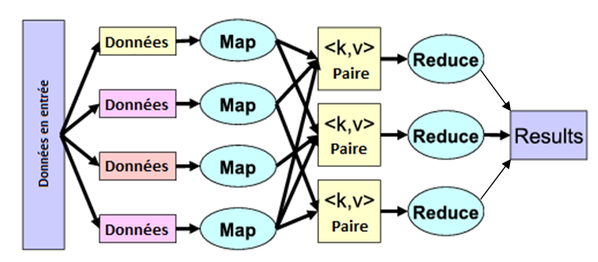

# MapReduce

## Problème

Le patron d'architecture donne un cadre pour la conception d'algorithme
capable de traiter des volumes de données importants par distribution des traitements.

## Principe 

L'algorithme procède par décomposition des données en lot (map) puis par fusion
des résultats (reduce).

source : [<https://fr.wikipedia.org/wiki/MapReduce>](https://fr.wikipedia.org/wiki/MapReduce)

## Cas des bases de données

Les bases de données distribuées appliquent ce principe pour traiter les requêtes.

## Exemples

* [Comptage de mot en MapReduce avec Hadoop (wiki.apache.org)](https://wiki.apache.org/hadoop/WordCount)

* [MapReduce by examples (slideshare.net)](http://fr.slideshare.net/andreaiacono/mapreduce-34478449) : 
Exemple de comptage, somme, moyenne, K-Means en MapReduce

