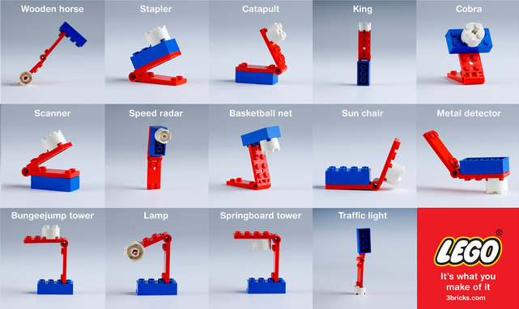
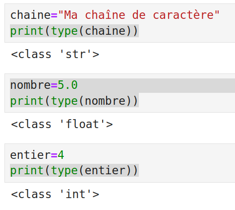

# Les patrons de conception

<br />

<div class="illustration">



</div>

---

## Plan

- [Introduction](#introduction)
- [Les bases de la P.O.O.](#les-bases-de-la-poo)
- [Les principes de conception](#les-principes-de-conception)
- [Les anti-patrons](#les-anti-patrons)
- [Les patrons de conception](#les-patrons-de-conception)
- [Les patrons de création](#les-patrons-de-création)
- [Les patrons de structure](#les-patrons-de-structure)
- [Les patrons de comportement](#les-patrons-de-comportement)
- [A vous maintenant!](#a-vous-maintenant)
- [Les patrons architecturaux](#les-patrons-architecturaux)
- [Le refactoring](#le-refactoring)
- [Encore à vous!](#encore-à-vous)
- [Conclusion](#conclusion)
- [Annexes et références](annexe/)

---

## Introduction

### Pourquoi faire des efforts de conception?

Il faut avoir en tête **la seule constante du développement : Le changement !**

De nombreux événements conduiront à modifier le code d'une application :

- Modification des fonctionnalités et modèles de données
- Changement de cible (desktop, serveur, mobile, cloud, etc.)
- Augmentation du nombre d'utilisateurs et des volumes de données (parallélisation, etc.)
- Obsolescence des outils (bibliothèques, frameworks, services tiers, etc.)
- Choix politique (base de données, opensource, etc.)
- ...

**Sans effort de conception, plus le temps passera, plus il sera difficile, coûteux et risqué de traiter ces changements**.

---

## Introduction

### Quels sont les critères qualités d'un programme?

Il conviendra de **cibler plusieurs critères qualités qui guideront la conception** :

- **Fiabilité**       : Pouvoir faire tourner le programme sans risque de plantage
- **Maintenabilité**  : Pouvoir facilement corriger un bug, mettre à jour les dépendances, etc.
- **Performance**     : Minimiser le temps d'exécution, la consommation de RAM, de stockage, etc.
- **Évolutivité**     : Pouvoir ajouter facilement des fonctionnalités sans risque de régression.
- **Réutilisabilité** : Pouvoir réutiliser un code dans un autre contexte.
- **Portabilité**     : Pouvoir porter facilement un programme développé pour une cible vers une autre.
- **Testabilité**     : Pouvoir écrire facilement des tests unitaires et fonctionnels pour un programme.
- ...

Nous serons souvent amené à **prioriser ces critères** (ex : privilégier les performances plutôt que la généricité)

---

## Introduction

### Les patrons de conception dans tout ça?

Ce cours s'inspire de la lecture de **"Design patterns: tête la première" de Eric Freeman et Kathy Sierra**. Nous allons d'abord balayer un ensemble de **prérequis** permettant de **comprendre l'intérêt des patrons de conception** :

- **Les concept de base de la P.O.O.**
- **Les principes de conception**

Nous verrons quelques **mauvaises pratiques** à travers les **anti-patrons**. Puis,
nous nous attarderons sur les **bonnes pratiques** avec les principaux **patrons de conception** qui seront mis en pratique avec un premier TP.

Nous verrons ensuite que ces principes et patrons de conception s'appliquent à d'autres niveaux du système avec les **patrons architecturaux**.

Nous verrons enfin comment **réfactorer un code existant** avec une partie théorique et un second TP.

---

## Les bases de la P.O.O.

### Un paradygme omniprésent

De nombreux programmeurs manipulent des objets sans forcément en avoir conscience :

- En appelant, `chaine.upper()` pour transformer une chaîne de caractères en majuscules, nous faisons appel à la **notation pointée** typique de la P.O.O.
- En Python, tout est objet :

<div class="center">
    
</div>

---

## Les bases de la P.O.O.

### Un paradigme difficile à maîtriser

**Utiliser des classes existantes ne demandera pas d'effort**. Il sera plus délicat de :

- **Concevoir proprement <u>ses propres classes</u>**
- **Faire un choix entre la définition d'une classe ou le recours à un autre paradigme** (ex : définition d'une fonction) quand le langage le permet.
---

## Les bases de la P.O.O.

### Un paradigme qui coexiste avec d'autres...

Dans ce cours qui présente les patrons de conception, nous allons nous concentrer sur la P.O.O. Nous mentionnerons toutefois la **possibilité de mixer les paradigmes dans la vraie vie** :

```js
const nombreUtilisateursMajeurs = userRepo.getUsers()
  .filter(user => user.age >= 18) // programmation fonctionnelle + P.O.O.
  .count()
;
```

---

## Les bases de la P.O.O.

### Les concepts de base

Les concepts suivants sont normalement connus avant de débuter ce cours :

- Les **classes** avec leurs **attributs** et leurs **méthodes**
- Les **constructeurs**
- Les **objets**
- La **visibilité** (public, private, protected)
- Les **accesseurs** (get, set, add, remove,...)
- Les **relations** (composition, agrégation)
- L'**héritage** et le **polymorphisme**
- Les **méthodes et classes abstraites**
- Les **interfaces**
- Les **méthodes statiques**
- Les **attributs statiques**

---

## Les bases de la P.O.O.

### Bien comprendre l'intérêt de ces concepts!

Les **concepts de classe, d'attribut et l'héritage sont généralement bien maîtrisés pour modéliser des données** (objet de domaine).

Il convient toutefois de **bien comprendre l'intérêt des autres concepts de la P.O.O.** pour **modéliser des traitements** :

- Se protéger contre des erreurs de programmation
- S'assurer d'être en mesure de modifier le code sans casser les appels 
- Pouvoir tester unitairement les fonctionnalités (en bouchonnant les autres à l'aide de "mock")
- ...

=> [Méditons quelques exemples](meditation.md).

---

## Les bases de la P.O.O.

### Une conception à adapter au langage

Les langages qui permettent de définir et manipuler les concepts de base de la P.O.O. sont nombreux (Java, JavaScript (ES6), TypeScript, C++, Python, PHP, Go, Rust,...).

Nous traiterons ce cours avec des exemples et TP en TypeScript en nous concentrant sur ce qui applicable à de nombreux langages.

Nous noterons toutefois que **[les langages ont des spécificités](annexe/specificites-langages.html) qui devront être prises en compte et exploitées dans la conception**.

---

## Les principes de conception

Nous allons maintenant parcourir quelques **principes de conception** qui s'ajoutent aux principes
de base de la P.O.O. (abstraction, encapsulation, etc.) et qu'il faut avoir en tête.

---

## Les principes de conception

### SOLID

Nous allons commencer par **5 principes fondamentaux** regroupés dans l'acronyme **SOLID** :

* **S**ingle Responsibility Principle (SRP, **responsabilité unique**)
* **O**pen Closed Principle (OCP, **ouvert/fermé**)
* **L**iskov Substitution Principle (LSP, **substitution de Liskov**)
* **I**nterface Segregation Principle (ISP, **ségrégation des interfaces**)
* **D**ependency Inversion Principle (DIP, **inversion des dépendances**)

---

## Les principes de conception

### (S)ingle Responsibility Principle

**Une classe remplit une fonction et une seule.**

.bad-left[
Cette classe permet la lecture des communes à partir d'un fichier [ADMINEXPRESS](https://geoservices.ign.fr/adminexpress) et le calcul des statistiques sur les communes.
]

.good-right[
* Cette classe permet le calcul des statistiques sur une liste de communes
* Cette classe lit les communes à partir d'un fichier [ADMINEXPRESS](https://geoservices.ign.fr/adminexpress)
]

---

## Les principes de conception

### (O)pen Closed Principle

**Une classe doit être est ouverte à l’extension, mais fermée aux modifications.**

.bad-left[
Pour modifier le comportement d'une classe existante, je modifie son code.
]

.good-right[
Pour modifier le comportement d'une classe, je peux en hériter et surcharger une ou plusieurs méthodes
]


---

## Les principes de conception

### (L)iskov Substitution Principle

**Lorsqu’une classe se substitue à une autre, le programme continue de fonctionner.**

.bad-left[
Cas 1 : J'ajoute une classe à une hiérarchie, je lance une exception "cette méthode n'est pas implémentée" sur une méthode.

Cas 2 : J'ajoute une classe à une hiérarchie, je provoque le lancement d'exception "cette méthode pas implémentée pour ce type" dans d'autres parties du code.
]

.good-right[
Avant d'hériter d'une classe, je m'assure que je pourrai implémenter toutes les méthodes et que ça ne posera pas de problème dans le reste du code.

]

---

## Les principes de conception

### (I)nterface Segregation Principle

**Préférer plusieurs interfaces spécifiques plutôt qu'une seule interface générale.**

.bad-left[
Je définis une interface `Client` avec des méthodes pour faire des requêtes HTTP (`httpGet`, `httpPost`,...), télécharger des fichiers FTP (`ftpGet`), envoyer des mails (`sendMail`)...
]

.good-right[
Je définis une interface pour chaque protocole : `HttpClient`, `FtpClient`, `Mailer`.
]

---

## Les principes de conception

### (D)ependency Inversion Principle

**Il faut dépendre des interfaces, pas des implémentations (classes concrètes).**

.bad-left[
Je référence des classes concrètes dans les déclarations des constructeurs et des méthodes :

* `GpsLocationProvider`
* `GeoplateformeGeocoder`
* ...


]

.good-right[
Je référence des interfaces dans les déclarations :

* `LocationProvider`
* `Geocoder`
* ...

]

---

## Les principes de conception

### DRY : Don't Repeat Yourself

**Il convient d'éviter les répétitions de code**

.bad-left[
Pour réutiliser un code, je le copie/colle dans ma méthode.
]

.good-right[
Pour réutiliser un code, je le **met en facteur** dans une méthode ou une classe que j'utilise à plusieurs endroits.
]


---

## Les principes de conception

### YAGNI : you ain't gonna need it

**Il convient de coder uniquement ce qui est utile, de ne pas ajouter du code en se disant que ça servira un jour.**


.bad-left[
* Je produis mes résultats dans de nombreux formats (shapefile, CSV, JSON, GeoJSON, GML,...)
* Je supporte la 2D et la 3D car certaines de mes sources de données sont en 3D.
* Je créé une classe `Batiment` avec tous les attributs BDTOPO.
]

.good-right[
* Je produis mes résultats dans un nombre limité de formats demandés par les utilisateurs.
* J'ignore la 3D tant que je ne l'utilise pas dans mon application.
* Je créé une classe `Batiment` avec les seuls attributs BDTOPO que j'utilise.
]


---

## Les principes de conception

### Principe d'exposition minimale

Il convient d'**exposer un minimum de fonctionnalités au niveau d'une classe** (i.e. de maximiser l'encapsulation).

En pratique, quand le langage le permet (PHP, Java, C++, TypeScript,...) :

* Les **méthodes et attributs sont privés par défaut**
* Les **accesseurs** sont définis et accessibles **uniquement si c'est nécessaire** (~~`traitement.getLogger()`~~)
* Une **méthode spécifique est préférée à un accesseur permettant de nombreuses opérations**
  * Les **collections sont encapsulées** (~~`obj.points.add(p)`~~ -> `obj.addPoint(p)` )


---

## Les principes de conception

### Identifier et encapsuler ce qui varie (1/3)

**Cas d'école** : J'identifie le besoin de **produire des journaux applicatifs (logs) plus ou moins détaillés**...

```ts
class MaClasse {

    faireUnTruc(){
        console.log("Je fais un truc");
        // ...
    }

}
```

---

## Les principes de conception

### Identifier et encapsuler ce qui varie (2/3)

... je fais abstraction sur l'écriture des journaux applicatifs à l'aide d'une classe `Logger` :

```ts
class MaClasse {

    logger: Logger;

    constructor(logger: Logger){
      this.logger = logger;
    }

    faireUnTruc(){
        this.logger.info("Je fais un truc");
    }

}
```

Je peux ainsi configurer le niveau de production des logs au niveau au niveau de l'instance `logger`.

---

## Les principes de conception

### Identifier et encapsuler ce qui varie (3/3)

Nous remarquerons que cette approche est aussi la clé pour **rendre un code unitairement testable** :

```ts
class MonTraitement {

  constructor(httpClient: HttpClient){
    this.httpClient = httpClient;
  }

  async afficheLesCommunes(codePostal: string): void {
    const url = 
      `https://apicarto.ign.fr/api/codes-postaux/communes/${codePostal}`
    ;

    // Non bouchonnable (appel statique)
    //const data = await fetch(url);

    // Bouchonnable (mock possible sur httpClient)
    const data = await this.httpClient.get(url);
    console.log(data);
  }
}
```


---

## Les principes de conception

### Préférer la composition à l'héritage (1/2)

* Nous **<u>pourrons</u> hériter d'une classe seulement si nous pouvons dire "EST-UN"** :
  * "Un `Cercle` est une `Forme`"
  * "~~Un `TraitementMetier` est une `BaseDeDonnees`~~" -> "Un `TraitementMetier` utilise une `BaseDeDonnees`".
* Nous **préférerons toutefois les états aux classes dérivées** :
  * Il sera naturel d'**hériter** d'une `Forme` pour modéliser des `Cercle` et des `Rectangle` avec des **attributs spécifiques** (`rayon` vs `largeur` et `hauteur`)
  * Pour une classe `Animal`, nous préférerons l'ajout d'un attribut `type` à la création de classes `Chat` et `Chien` dérivées sans attributs spécifiques.

---

## Les principes de conception

### Préférer la composition à l'héritage (2/2)

Pourquoi? Notez dans un premier temps que :

* L'**héritage** est une **relation plus forte que la composition** (il est donc plus difficile de s'en libérer)
* Si vous développez un formulaire, modifier un `type` (affectation) est plus simple que transformer un `Chien` en `Chat` (construction).

> Spoiler : Nous verrons plus tard en détail avec le patron [Strategy](annexe/design_pattern/behavior/Strategy.html) en quoi l'approche par composition est préférable à la surcharge d'une seule méthode pour faire varier le comportement d'une classe.


---

## Les anti-patrons

Avant de mettre un nom sur des modèles de conception, nous allons maintenant **mettre un nom sur des erreurs de conception courantes : Les anti-patrons !**

---

## Les anti-patrons

### Principe des anti-patrons

* **Nommer** des erreurs de conception classiques
* Faciliter l'identification des erreurs de conception

---

## Les anti-patrons

### Réinventer la roue carrée

**Ne pas s'appuyer sur une solution existante.**

Par exemple :

* Développer son propre système pour l'écriture des journaux applicatifs
* Développer son propre système d'exécution de tests unitaires
* ...

---

## Les anti-patrons

### Programmation spaghetti

**Le rôle des différents éléments du système n'est pas identifiable et il est difficile de savoir qui appelle qui**.

En conséquence, il est difficile de :

* Modifier une partie du code sans en altérer le fonctionnement
* Trouver la cause d'un bug
* ...

> Spoiler : Nous verrons que les patrons architecturaux amènent un cadre permettant d'éviter ce problème.

---

## Les anti-patrons

### Objet divin

L'objet divin porte un **trop grand nombre de responsabilités**.

Il est en **violation flagrante du principe de responsabilité unique (SRP)**.

---

## Les anti-patrons

### Abstraction inverse

Un **composant ne fournit pas les abstractions nécessaires**, mais seulement les méthodes les plus compliquées.

**Les abstractions sont développées dans les clients**.

> Spoiler : Nous verrons comment le patron façade permet d'y remédier.

---

## Les anti-patrons

### Marteau doré

Avec un bon marteau, tous les problèmes sont des clous! **Un outil est placé comme solution à tous les problèmes.**

<div class="center">
    
    <br />
    (Source <a href="http://www.engravingawardsgifts.com/">engravingawardsgifts.com</a>)
</div>

Il peut s'agir d'une bibliothèque, d'une base de données, d'une suite de logiciel, etc.

---

## Les anti-patrons

### Coulée de lave

**Un code non finalisé est mis en production. Il n'est plus possible de le remanier.**

Ce problème pourra concerner aussi bien des bibliothèques que des API WEB ou en ligne de commande (CLI). Il conviendra de considérer que **livrer revient à figer les interfaces publiques**.

> Spoiler : Nous verrons dans la partie [refactoring](refactoring.md) que nous pourrons **traiter les changements en gérant proprement des versions**.

---

## Les anti-patrons

### Premature Optimisation (1/2)

**"Premature optimization is the root of all evil" (Donald Knuth)**

* Gaspillage d'énergie pour des gains médiocres (voire négatifs).
* Complexité rendant impossible les optimisations globales.
* Complexité mettant en péril la qualité du logiciel (stabilité, maintenabilité, portabilité, etc.)

Exemples :

* Optimiser le parcours séquentiel d'un tableau au point qu'il devient impossible d'exploiter un indexe spatial.
* "Je n'ai pas besoin des arcs entrants pour cet algorithme, je développe une classe dédiée pour ce graphe afin de consommer moins de mémoire!". Bilan : Le programme réel passe son temps à faire des copies de graphes.

---

## Les anti-patrons

### Premature Optimisation (2/2)

"Premature optimization is the root of all evil" (Donald Knuth) **mais :**

* Il ne faut pas en conclure que l'optimisation doit être ignorée dans la conception!
* Il faut rester prudent sur cette affirmation pour les bibliothèques de bas niveau!
* Parfois, on privilégie la performance à la généricité.

Proposition de méthode :

* **Se concentrer sur les optimisations globales dans la conception** (choix de structures efficaces, indexation, mise en cache, etc.).
* Coder en mettant en place des **tests** et des **mesures de performance** (*bench*).
* **Profiler** et réaliser les **optimisations locales sur les fonctions souvent appelées**

---

## Les patrons de conception

Nous y venons enfin! Alors, les **patrons de conception**, Quésako?

---

## Les patrons de conception

### Définition

Le concept de patron de conception a été défini par le **« Gang of Four » (Erich Gamma, Richard Helm, Ralph Johnson et John Vlissides)** dans le **livre "Design Patterns -- Elements of Reusable Object-Oriented Software" (1994)**.

Un **patron de conception** est la **description d'une solution réutilisable pour un problème de conception**.

---

## Les patrons de conception

### Formalisme des patrons de conception

Ces patrons obéiront au formalisme suivant :

* Un **nom**
* Un **problème**
* Une **solution**
* Des **conséquences** (avantages et inconvénients)

---

## Les patrons de conception

### Famille de patrons de conception du GoF

Le « Gang of Four » définit trois familles de patrons de conception :

* Les **patrons de création** (*creational patterns*) qui décrivent des **techniques d'initialisation des objets**
* Les **patrons de structure** (*structural patterns*) qui décrivent des **organisations classiques de classes**
* Les **patrons de comportement** (*behavioral patterns*) qui décrivent des **méthodes de communication entre objets**

---

## Les patrons de conception

### Autres familles de patrons de conception

Le concept de patron sera étendu par la suite et nous trouverons en complément :

* Des **patrons architecturaux** qui traitent des styles d'architecture de logiciel (MVC, micro-service, etc.)
* Des familles de **patrons spécifiques à des domaines d'application** (cloud, big-data, etc.)
* Des familles de **patrons spécifiques à des frameworks** (spring, etc.)

---

## Les patrons de conception

### Intérêts des patrons de conception (1/2)

Les patrons de conception permettront de :

* **Faciliter la compréhension des codes** par l'utilisation d'un **vocabulaire commun** (`*Builder`, `*Factory`, `addChild`, etc.)
* **Faciliter la découverte du code et la compréhension des architectures** en standardisant celles-ci (MVC, IoC, MQ, etc.)
* **Trouver de l'inspiration dans la recherche d'une solution** :
  * Comment implémenter un interpréteur?
  * Comment implémenter un annuler/refaire?
  * Est-ce qu'il y a un framework MVC avec de l'injection de dépendance pour ce langage?

---

## Les patrons de conception

### Intérêts des patrons de conception (2/2)

En particulier, la **connaissance des patrons facilitera l'apprentissage la découverte des bibliothèques et frameworks orientés objets**.

Pour faire simple, **sans connaissance des patrons, certains choix de conception sembleront inutilement complexes** et il sera **difficile de trouver comment initialiser les objets**.

---

## Les patrons de création

Nous nous concentrerons sur les patrons de création du GoF ci-après :

* [Singleton](annexe/design_pattern/creational/Singleton.html)
* [Prototype](annexe/design_pattern/creational/Prototype.html)
* [Factory (Fabrique)](annexe/design_pattern/creational/Factory.html)
* [Builder (Monteur)](annexe/design_pattern/creational/Builder.html)

Nous irons un peu plus loin avec :

* [Fluent Interface](annexe/design_pattern/creational/FluentInterface.html)
* Le [couplage de Fluent Interface et Builder](annexe/design_pattern/creational/FluentInterface.html)

---

## Les patrons de structure

Nous nous concentrerons sur les patrons de structure du GoF ci-après :

* [Facade (Façade)](annexe/design_pattern/structural/Facade.html)
* [Decorator (Décorateur)](annexe/design_pattern/structural/Decorator.html)
* [Composite (Objet composite)](annexe/design_pattern/structural/Composite.html)
* [Adapter (Adaptateur)](annexe/design_pattern/structural/Adapter.html)
* [Bridge (Pont)](annexe/design_pattern/structural/Bridge.html)

Nous noterons qu'il en existe d'autres :

* Proxy
* Flyweight (Poids-mouche)

---

## Les patrons de comportement

Nous nous concentrerons sur les patrons de comportement du GoF ci-après :

* [Iterator (Itérateur)](annexe/design_pattern/behavior/Iterator.html)
* Template Method (Patron de méthode)
* [Strategy (Stratégie)](annexe/design_pattern/behavior/Strategy.html)
* [Visitor (Visiteur)](annexe/design_pattern/behavior/Visitor.html)
* [Chain of responsibility (Chaîne de responsabilité)](annexe/design_pattern/behavior/ChainOfResponsibility.html)
* [Observer (Observateur)](annexe/design_pattern/behavior/Observer.html)
* [State (État)](annexe/design_pattern/behavior/State.html)
* Mediator (Médiateur)
* Command (Commande)
* Interpreter (Interpréteur)
* Memento (Mémento)

Nous nous intéresserons en complément à :

* [Null Object (objet null)](annexe/design_pattern/behavior/NullObject.html)

---

## A vous maintenant!

Pour bien comprendre l'intérêt des patrons de conception, nous allons traiter le [TP - Mise en oeuvre des patrons de conception avec des classes géométriques](annexe/tp-geometry/index.html)

---

## Les patrons architecturaux

Nous avons vu jusque là des patrons de conception à l'échelle de quelques classes. Nous soulignerons l'existence de **patron de conception architecturaux** agissant à l'**échelle d'une application ou d'un système** :

* [Architecture en couches](annexe/design_pattern/architectural/couches.html)
* [Architecture micro-service](https://learn.microsoft.com/fr-fr/azure/architecture/guide/architecture-styles/microservices)
* [Model-View-Controller (MVC)](annexe/design_pattern/architectural/MVC.html)
* [Inversion de contrôle (IoC)](https://fr.wikipedia.org/wiki/Inversion_de_contr%C3%B4le) et [injection de dépendance](https://fr.wikipedia.org/wiki/Injection_de_d%C3%A9pendances)
  * [Angular (JavaScript/TypeScript)](https://v17.angular.io/guide/dependency-injection)
  * [Symfony (PHP)](https://symfony.com/doc/current/components/dependency_injection.html#basic-usage)
* [Event-Driven architecture (EDA)](https://learn.microsoft.com/fr-fr/azure/architecture/guide/architecture-styles/event-driven)
  * [RabbitMQ Tutorials](https://www.rabbitmq.com/tutorials)
* [MapReduce](annexe/design_pattern/architectural/MapReduce.html)

---

## Le refactoring

Nous noterons que souvent, nous serons face à des applications existantes où il sera potentiellement intéressant de **se mettre en conformité avec des principes de conception** et d'**introduire des patrons de conception**.

Nous verrons rapidement [les grands principes du refactoring de code](refactoring.md) avant de poursuivre avec un nouveau TP.

Vous pourrez parcourir en autonomie [refactoring.com - Catalogue](http://www.refactoring.com/catalog/) et lire en complément ["Clean Code" de Robert C. Martin résumé derrière ce lien](https://gist.github.com/cedrickchee/55ecfbaac643bf0c24da6874bf4feb08#file-clean_code-md) sera aussi intéressant.

---

## Encore à vous!

Nous allons traiter [TP - Réfactoring sur des traitements de graphe](annexe/tp-graph/index.html) où l'idée est de faire une **mise en situation d'optimisation et d'industrialisation d'un code existant**.

Vous pourrez constater :

* La **difficulté de l'exercice de refactoring** (donc l'intérêt de **respecter dès le début les principes de conception**)
* Que l'utilisation **de patrons de conception aide à respecter ces principes** (sans résoudre pour autant tous les problèmes)
* L'intérêt des **tests pour éviter des régressions**

---

## Conclusion

Après ce cours et ces TP, j'espère que vous comprendrez qu'il est **fondamental de respecter les principes de conception** à tous les niveaux du système et en quoi **les patrons de conception peuvent vous aider**.

### Comment progresser?

* **Comprendre** et apprendre les principaux patrons de conception
* **Identifier les patrons de conception dans les codes existants** (rechercher les fabriques, les monteurs, les stratégies, les décorateurs, etc.)
* **Expérimenter** (et apprendre de ses erreurs)! 
* **Concevoir** des codes en pensant aux **principes de conception** et **patrons de conception** (sans sombrer dans la paternite)
* **Concevoir des codes en les testant unitairement** (un code mal conçu ne pouvant être testé unitairement)
* **Comprendre des architectures existantes** (vous constaterez que **les mêmes principes de conceptions s'appliquent à diverses échelles des systèmes**)
