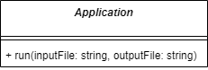
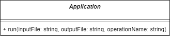
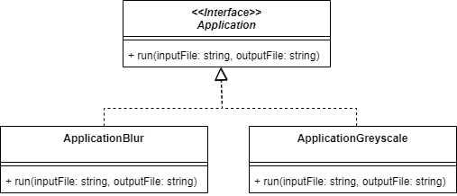
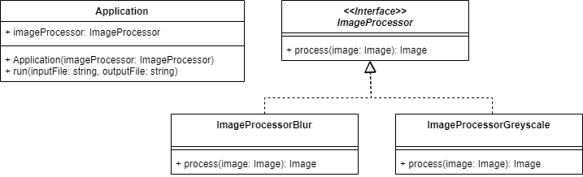

# Strategy

[[toc]]

## Problème

Nous souhaitons pouvoir **faire varier dynamiquement le comportement d'une partie d'un traitement**.

## Cas d'école

Prenons le cas d'une **application de traitement d'image** qui applique les trois étapes suivantes :

* Charger une image PNG à partir d'un fichier (`inputFile`)
* Flouter l'image (`blur`)
* Sauvegarder l'image dans un fichier (`outputFile`)



Nous l'exposons en ligne de commande sous la forme suivante :

```bash
traitement-image data/joconde.jpg data/joconde-blur.jpg
```

> Voir [mborne/ts-pattern-strategy - branche initial](https://github.com/mborne/ts-pattern-strategy/tree/initial#readme)

## Problème

Nous souhaitons faire évoluer l'application pour permettre le choix entre plusieurs opérations :

* Flouter l'image (`blur`)
* Convertir l'image en niveau de gris (`greyscale`)

Nous ciblons pour cela l'ajout d'un paramètre à l'API en ligne de commande comme suit :

```
traitement-image {inputFile} {outputFile} (blur|greyscale)
```

## Tentons différentes approches...

### Pouvons nous nous appuyer sur un switch?

Nous pourrions nous contenter d'ajouter un paramètre à la méthode `run` et traiter les différents cas en fonction `operationName` :



Cette approche serait la plus simple mais elle possède plusieurs défauts :

* Ajouter un algorithme impliquera la mise à jour de `run` (violation du principe ouvert/fermé)
* La classe `Application` aura tendance à devenir un **objet divin**.
* En particulier, nous risquons à terme de multiplier les attributs spécifiques aux différents traitements (ex : `blurRadius`) sur la classe `Application`.

### Pouvons nous exploiter le polymorphisme?

Nous pourrions promouvoir `Application` en interface et nous appuyer sur le polymorphisme comme suit :



> Voir [mborne/ts-pattern-strategy - branche heritage](https://github.com/mborne/ts-pattern-strategy/tree/heritage#readme)

A première vue, nous pourrions être satisfait d'une telle conception...

**Problème : Que se passe-t'il si nous souhaitons maintenant pouvoir appliquer deux traitements successifs?**

Nous avons soit :

* Une **explosion combinatoire** (`ApplicationBlur`, `ApplicationGreyscale`, `ApplicationGreyscaleBlur`, `ApplicationBlurGreyscale`)
* Des écritures/relectures multiples de fichiers si nous nous écrivons dans un fichier temporaire.

Le problème de fond réside dans le fait que **nous ne respectons pas plusieurs principes de conception** :

* Le **principe de responsabilité unique** (`Application` assure le calcul ainsi que l'orchestration de la lecture et les écritures des fichiers).
* **Privilégier la composition à l'héritage s'applique aussi pour l'encapsulation des traitements**.

## Solution

Avec le **patron Strategy**, nous allons **encapsuler le traitement dans un objet dont le seul rôle se limitera à appliquer le traitement** (`ImageProcessor`) :



Pour enchaîner les traitements (ex : `blur,greyscale`), nous pourrons par exemple exploiter le patron de conception [Composite](../structural/Composite.md) en modélisant une liste de traitement sous forme d'une `ImageProcessorList`.

> Voir [mborne/ts-pattern-strategy - branche strategy](https://github.com/mborne/ts-pattern-strategy/tree/strategy#readme)
