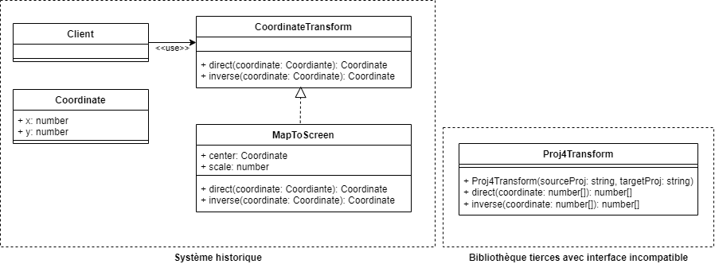
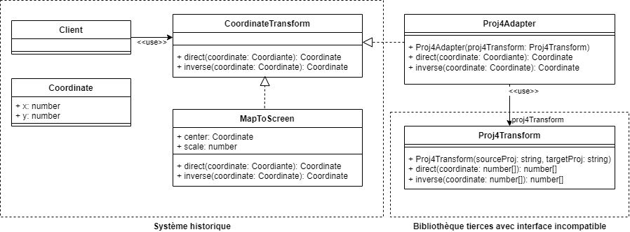

# Adapter (Adaptateur)

## Problème

**Nous avons deux interfaces qui ont des fonctionnalités équivalentes mais qui sont incompatibles**. 

## Cas d'école

Nous travaillons sur un système historique où seules des transformations de coordonnées triviales sont réalisées entre des coordonnées cartographiques et des coordonnées écrans. Nous souhaitons intégrer la gestion des reprojections cartographiques à l'aide d'une bibliothèque mettant à disposition une classe `Proj4Transform` avec quelques différences de conception :



En particulier, `Proj4Transform` prend des tableaux en paramètre quand notre système utilise une classe `Coordinate`.

## Solution

Nous pouvons implémenter `CoordinateTransform` en utilisant une instance de `Proj4Transform` :



Nous aurons par exemple le code suivant pour l'adaptation :

```ts
class Proj4Adapter implements CoordinateTransform {

    proj4Transform: Proj4Transform;

    constructor(proj4Transform: Proj4Transform){
        this.proj4Transform = proj4Transform;
    }

    direct(c: Coordinate){
        const result = this.proj4Transform.direct([c.x,c.y]);
        return {
            x: result[0],
            y: result[1]
        }
    }

    inverse(c: Coordinate){
        const result = this.proj4Transform.inverse([c.x,c.y]);
        return {
            x: result[0],
            y: result[1]
        }
    }

}
```

A l'utilisation :

```ts
// construction de l'instance à adapter
const proj4Transform = new Proj4Transform("EPSG:2154","EPSG:3857");
// encapsulation de l'instance avec l'adaptateur
const transform = new Proj4Adapter(proj4Transform);
```

## Variantes

Il existe **plusieurs approches pour gérer les traitements asynchrones**. Le concept d'adapteur pourra par exemple être repris dans le cadre de la conversion de callback en [Promise](https://developer.mozilla.org/fr/docs/Web/JavaScript/Reference/Global_Objects/Promise).

## Liens utiles

* [fr.wikibooks.org - Adaptateur](https://fr.wikibooks.org/wiki/Patrons_de_conception/Adaptateur)
* [refactoring.guru - Adaptateur](https://refactoring.guru/fr/design-patterns/adapter)
