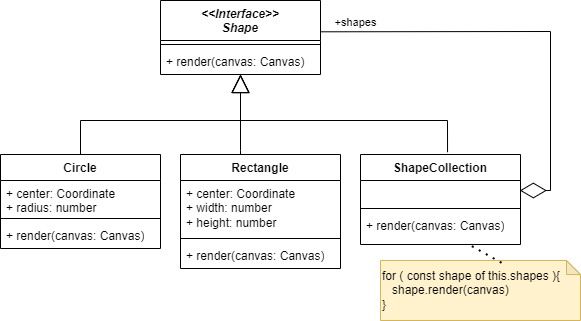

# Composite

## Problème

Nous manipulons un **arbre** et nous souhaitons **réaliser un traitement sans faire la distinction entre les noeuds porteurs d'enfants et les feuilles**.

## Cas d'école

Dans un éditeur, nous manipulons des formes (`Shape`) primitives (`Circle`, `Rectangle`, etc.) et
des groupes de formes (`ShapeCollection`).

Nous ne souhaitons pas traiter un cas particulier pour le rendu de ces groupes de formes.

## Solution

Le patron composite propose de procéder comme suit :

Source [<https://en.wikipedia.org/wiki/Composite_pattern>](https://en.wikipedia.org/wiki/Composite_pattern)

Dans notre cas d'école, nous pourrons procéder comme suit :

