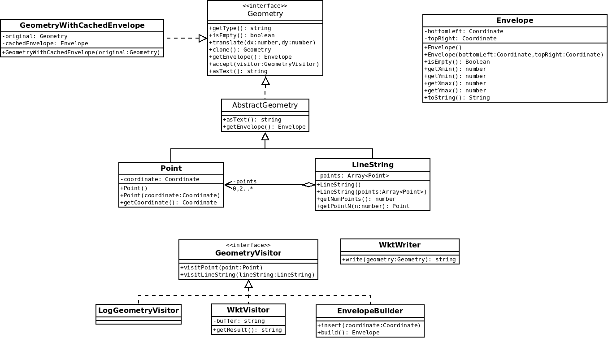

# TP - Mise en oeuvre des patrons de conception avec des classes géométriques

[[toc]]

## Introduction

L'objectif de ce TP est de s'exercer à mettre en oeuvre des patrons de conception via la création d'une petite bibliothèque de manipulation des géométries OGC :


Vous noterez toutefois que **ceci n'est qu'un exercice** :

* **Nous allons réinventer la roue carrée** (utilisez plutôt [JSTS](https://github.com/bjornharrtell/jsts?tab=readme-ov-file#jsts) et [Turf.js](https://turfjs.org/) dans la vraie vie).
* **Nous allons sombrer dans la paternite** (les patrons de conception ne seront pas la solution à tous les problèmes et nous n'en n'utiliserons pas autant)

## Démarrage

* Forker le projet https://github.com/mborne/tp-geometry-ts
* Cloner le fork
* Lire le fichier [README](https://github.com/mborne/tp-pattern-geometry#tp-pattern-geometry)
* Exécutez les tests et afficher le rapport de couverture.

## Mise en garde

Vous devrez impérativement :

* **Livrer un code fonctionnel et testé sur la <u>branche par défaut</u> de votre fork**
* **Avoir au moins un commit (voire une branche) par question avec un commentaire d'identifier la question** (ex `0.1 - ajout de l'interface Geometry et des classes Point et LineString`)

Pour ce faire, il vous est vivement conseillé de :

* Lancer à chaque étape la construction et les tests automatiques (`mvn clean package`)
* Travailler avec une branche "dev" si vous voulez pousser des résultats non finalisés.

---

**ATTENTION : L'adaptation des questions ci-dessous est en cours**

---

## XX - Geometry, Point et LineString

> Objectif : Préparation du TP, utilisation d'interface, encapsulation

Implémenter les trois classes suivantes illustrées sur le schémas ci-après :


Remarques :

* `getType()` renverra le nom de la classe en *CamelCase* (`"Point"` ou `"LineString"`)
* Nous nous interdirons de modifier ce comportement dans les questions suivantes (~~`"POINT"`~~, ~~`"LINESTRING"`~~).


## XX - Geometry.isEmpty()

> Objectif : Bonne pratique *NonNullObject*

Dans la question précédente, nous remarquons que nous avons des choix à faire dans les constructeurs par défaut de `Point` et `LineString`.

Afin d'éviter d'avoir à tester des `coordinate` ou `points` null, nous allons ajouter le **concept de géométrie vide** :

* S'assurer que la variable membre `coordinate` de `Point` n'est jamais nulle.
* S'assurer que la variable membre `points` de `LineString` n'est jamais nulle (une liste vide est préférable à une valeur nulle).
* Déclarer `Geometry.isEmpty` et l'implémenter dans `Point` et `LineString`


Remarque : 

* Nous tâcherons de blinder les appels `new Point(null)` et `new LineString(null)`
* Nous ne traiterons pas le cas d'un appel `new LineString(points)` avec un point null.

## XX - Geometry.translate(dx,dy)

> Objectif : Exploiter une interface pour réaliser un traitement spécifique

Ajouter une méthode de permettant de translater une géométrie.


Remarque : Vous serez amené à créer une nouvelle `Coordinate` pour l'implémentation dans `Point`.

## XX - Geometry.clone()

> Objectif : Patron de conception *Prototype*

En introduisant la fonction précédente, nous avons renoncé à l'idée d'avoir des géométries immuable (non modifiable après construction).

Nous allons donc ajouter une méthode `clone()` permettant de récupérer une copie d'une géométrie :


Exemple d'utilisation :

```java
Geometry copy = g.clone();
copy.translate(10.0,10.0);
//... "g" n'est pas modifiée
```

Remarques :

* Sans `clone()`, un traitement particulier serait nécessaire pour copier un `Point`, une `LineString`, etc.
* Nous procéderons à une **copie en profondeur** pour les seules propriétés non immuables.


## XX - Envelope et EnvelopeBuilder

> Objectif : Patron de conception Builder

Nous souhaitons calculer l'emprise d'une géométrie (la bbox). La logique de calcul de min/max en oeuvre étant assez complexe, nous ne souhaitons pas l'implémenter dans les classes `Point` et `LineString`.

Nous allons donc procéder comme suit :

* Ajouter une classe `Envelope` représentant une emprise rectangulaire de la géométrie avec le format suivant pour `toString()` : `xMin,yMin,xMax,yMax` (c'est celui de WMS)
* Ajouter une classe utilitaire `EnvelopeBuilder` qui aura pour rôle de construire cette emprise


Exemple d'utilisation :

```java
EnvelopeBuilder builder = new EnvelopeBuilder();
builder.insert(new Coordinate(0.0,1.0));
builder.insert(new Coordinate(2.0,0.0));
builder.insert(new Coordinate(1.0,3.0));
Envelope result = builder.build();
```

Remarques : 

* Vous avez la **liberté d'ajouter des variables membres privées** dans `EnvelopeBuilder` pour le calcul.
* En cas de difficulté pour faire des calculs de min/max optimaux, vous pouvez par exemple vous appuyer sur deux variables privées `xVals: List<Double>` et `yVals: List<Double>` pour exploiter les fonctionnalités standards java :

```java
List<Double> xVals = new ArrayList<Double>();
xVals.add(1.0);
xVals.add(-1.0);
xVals.add(3.0);
double xmin = Collections.min(xVals);
double xmax = Collections.max(xVals);
Assert.assertEquals(-1.0,xmin,EPSILON);
Assert.assertEquals(3.0,xmax,EPSILON);
```

Cette approche ne sera pas "optimale", mais elle peut être un premier jet permettant la mise en oeuvre des tests avant optimisation.

## XX - Geometry.getEnvelope() : Envelope

> Objectif : Facade sur EnvelopeBuilder

Ajouter une méthode utilitaire sur `Geometry` pour récupérer facilement l'enveloppe comme suit :

* Déclarer une méthode `getEnvelope` dans `Geometry`
* Implémenter cette méthode dans `Point` et `LineString` à l'aide de `EnvelopeBuilder`


## XX - WktWriter

> Objectif : Mesurer l'intérêt d'une conception propre et de GeometryVisitor dans les questions suivantes

Ajouter une classe `WktWriter` avec une méthode permettant de convertir une géométrie au [format WKT](https://fr.wikipedia.org/wiki/Well-known_text) qui prendra par exemple les formes suivantes :

```
POINT EMPTY
POINT(3.0 4.0)
LINESTRING EMPTY
LINESTRING(0.0 0.0,1.0 1.0,5.0 5.0)
```


Exemple d'utilisation :

```java
Geometry g = new Point(new Coordinate(3.0,4.0));
WktWriter writer = new WktWriter();
assertEquals("POINT(3.0 4.0)", writer.write(g));
```

Remarques :

* Nous ne modifierons pas les classes `Geometry`, `Point` et `LineString` pour mettre en oeuvre cette fonctionnalité.
* Nous utiliserons un fragment de code du style suivant pour traiter les différents types concrets :

```java
if ( geometry instanceof Point ){
    Point point = (Point)geometry;
    // traiter le cas Point
}else if ( geometry instanceof LineString ){
    LineString lineString = (LineString)geometry;
    // traiter le cas LineString
}else{
    throw new RuntimeException("geometry type not supported");
}
```

## XX - GeometryVisitor

> Objectif : Patron de conception Visitor, prise en main

* Ajouter l'interface `GeometryVisitor`
* Implémenter un visiteur `LogGeometryVisitor` qui affiche la géométrie dans la console sous les formes suivantes :
    * "Je suis un point vide."
    * "Je suis un point avec x=2.0 et y=3.0."
    * "Je suis une polyligne vide."
    * "Je suis une polyligne définie par 3 point(s)."


Exemple d'utilisation :

```java
LogGeometryVisitor visitor = new LogGeometryVisitor();
Geometry geometry = new Point(new Coordinate(3.0,4.0));
geometry.accept(visitor);
```

Pour tester les écritures dans la console de `LogGeometryVisitor`, nous remarquerons que `System.out` est de type `PrintStream` et qu'il est possible d'écrire dans une chaîne de caractère plutôt que dans la console en procédant comme suit :

```java
ByteArrayOutputStream os = new ByteArrayOutputStream();
PrintStream out = new PrintStream(os);
LogGeometryVisitor visitor = new LogGeometryVisitor(out);
geometry.accept(visitor);
// result contiendra ce qui est écrit dans la console
String result = os.toString("UTF8");
```


## XX - WktVisitor

> Objectif : Patron de conception Visitor, mise en oeuvre dans un cas concret

Reprendre l'implémentation de WktWriter sous la forme d'un GeometryVisitor en implémentant une classe `WktVisitor`.


Exemple d'utilisation :

```java
WktVisitor visitor = new WktVisitor();
Geometry geometry = new Point(new Coordinate(3.0,4.0));
geometry.accept(visitor);
assertEquals( "POINT(3.0 4.0)", visitor.getResult() );
```

Remarque : Au niveau de `visit`, on écrira dans la variable membre `buffer` à l'aide de `append` de `StringBuilder`. Au niveau de `getResult()`, on récupérera la chaîne du `buffer` à l'aide de `toString` de `StringBuilder`.

## XX - Geometry.asText()

> Objectif : Patron de conception Facade, héritage à trois niveau avec interface et abstract.

A l'aide de `AbstractGeometry` et `WktVisitor` :

* Ajouter une méthode `Geometry.asText(): String` renvoyant la géométrie au format WKT
* Ajouter une classe astraite `AbstractGeometry` implémentant la méthode `asText`


Remarque : Il faudra redéclarer la méthode `clone()` au niveau de `AbstractGeometry`.

## XX - EnvelopeBuilder en tant que GeometryVisitor

> Objectif : Visitor, refactoring (extraction de l'implémentation d'une fonctionnalité)

* Transformer `EnvelopeBuilder` en `GeometryVisitor`
* Remonter l'implémentation de `getEnvelope` dans `AbstractGeometry`




## XX - GeometryWithCachedEnvelope

> Objectif : Patron de conception Decorator

* Implémenter une classe `GeometryWithCachedEnvelope` qui permet de mettre en cache le calcul de l'enveloppe


Exemple d'utilisation :

```java
Geometry g = new Point(new Coordinate(3.0,3.0));
// décoration
g = new GeometryWithCachedEnvelope(g);
Envelope a = g.getEnvelope() ; // calcul et stockage dans cachedEnvelope
Envelope b = g.getEnvelope() ; // renvoi de cachedEnvelope
assertSame(a,b);
```

Remarque : on traitera l'invalidation du cache en cas de modification de la géométrie originale à la prochaine question.

## XX - GeometryListener

> Objectif : Patron de conception Observable

Pour être en mesure d'invalider l'enveloppe précalculée en cas de modification d'une géométrie, nous allons mettre en place un mécanisme d'événement :


* Ajouter une interface `GeometryListener` qui permettra aux utilisateurs d'être notifié en cas de modification d'une géométrie
* Notifier une modification aux `listeners` dans `translate(dx,dy)` à l'aide de `triggerChange`
* Exploiter ce mécanisme pour recalculer l'enveloppe en cas de modification dans `GeometryWithCachedEnvelope` qui s'ajoutera comme un `listener`


Remarque : `translate` étant la seule fonction capable de modifier une géométrie, il serait actuellement possible de se contenter d'invalider l'enveloppe en surchargeant `translate` dans `GeometryWithCachedEnvelope` pour nettoyer au passage le cache. Rien ne garanti toutefois que `translate` reste la seule fonction à même de modifier une géométrie et que toutes ces fonctions restent déclarées au niveau `Geometry`.


## XX - GeometryCollection

> Objectif : Patron de conception Composite, Refactoring

Ajouter une classe `GeometryCollection` représentant une géométrie multiple, adapter les autres fonctionnalitées.


Remarque : 

* Le format WKT prendra la forme suivante pour les `GeometryCollection` :

```
GEOMETRYCOLLECTION EMPTY
GEOMETRYCOLLECTION(POINT(3.0 4.0),LINESTRING(0.0 0.0,1.0 1.0,5.0 5.0))
```

## XX - GeometryVisitor renvoyant un résultat

> Objectif : Exploiter les classes génériques, visiteur renvoyant directement un résultat.

Pour avoir la capacité de renvoyer des résultats avec des types variables :

* Transformer la classe `GeometryVisitor` en `GeometryVisitor<T>`.
* Adapter les visiteurs existants ne renvoyant pas de résultat en implémentant `GeometryVisitor<Void>`.
* Ajouter une classe `LengthVisitor<Double>` renvoyant la longueur de la géométrie en guise de démonstration (0.0 pour un point)

```java
LengthVisitor<Double> visitor = new LengthVisitor<Double>();
Double result = geometry.accept(visitor);
```
