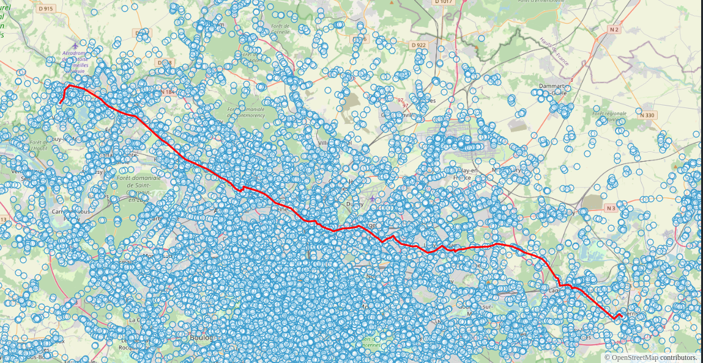
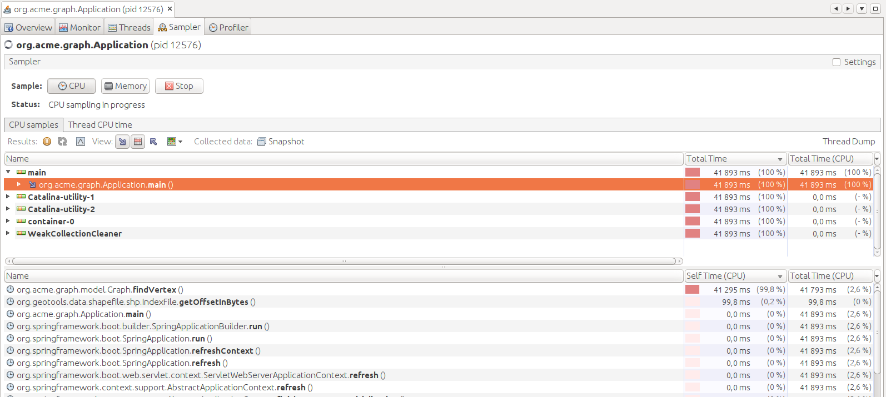
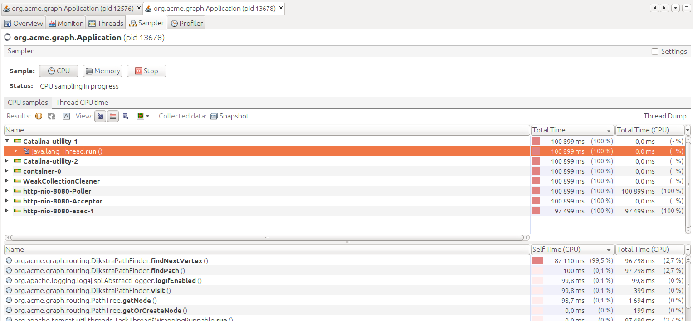

# TP - Refactoring de traitement de graphe

## Introduction

Dans ce TP, l'idée est de se mettre en situation où **nous devons industrialiser un prototype**. Nous allons réfactorer une **application qui charge un graphe et calcule le plus court chemin** entre deux sommets.

L'application se présente sous la forme d'une API basée sur [spring boot](https://spring.io/guides/gs/spring-boot/) avec un démonstrateur OpenLayers :



## Objectifs

Les objectifs sont les suivants :

* Rendre le code plus robuste
* Améliorer les entrées/sorties du programme
* Optimiser le chargement du graphe
* Optimiser le calcul de plus court chemin
* Ajouter une fonctionnalité de calcul d'isochrone

Pour cela, nous procéderons par étape.

## Démarrage

* Forker le projet https://github.com/mborne/tp-graph-java
* Cloner le fork
* Lire le fichier [README](https://github.com/mborne/tp-graph-java#tp-graph-java) pour :
  * Découvrir l'organisation du code
  * Construire le projet et exécuter les tests
  * Démarrer et tester l'API et son démonstrateur

## Mises en garde

Le TP a été modifié par rapport aux sessions précédentes (vous ne devez pas exploiter les forks existants). En outre, vous devrez impérativement :

* **Livrer un code fonctionnel sur la <u>branche par défaut</u> de votre fork**.
* **Avoir au moins un commit (voire une branche) par question avec un commentaire permettant de l'identifier**.

Pour ce faire, il vous est vivement conseillé de :

* Lancer à chaque étape la construction et les tests automatiques (`mvn clean package`).
* Compléter ces tests automatiques avec un test manuel sur l'API.


## 0.1 - Blindage de la construction des arcs

Nous remarquons que le modèle ne protège pas contre les erreurs la création des sommets et des arcs. Il est tout à fait possible de créer par erreur un `Edge` avec une `source` ou une `target` nulle.

Nous procédons comme suit :

* Ajout d'un constructeur `Edge(source: Vertex, target: Vertex)`
* Suppression du constructeur par défaut sur `Edge`

## 0.2 - Ajout de fabriques pour les sommets et les arcs

En ajoutant un constructeur `Edge(source: Vertex, target: Vertex)`, nous remarquons que nous avons simplifié la création des arcs et des sommets.

Toutefois, les opérations de création demeurent complexes et il reste la possibilité d'oublier d'ajouter les éléments aux listes de `vertices` et `edges` du graphe.

Nous allons donc procéder comme suit :

* Ajout d'une fabrique `createVertex(coordinate: Coordinate, id: String): Vertex` dans `Graph`
* Ajout d'une fabrique `createEdge(source: Vertex, target: Vertex, id: String): Edge` dans `Graph`
* Masquage des constructeurs `Vertex()` et `Edge(source,target)`

Ainsi, à l'usage, nous passerons de :

```java
Vertex a = new Vertex();
a.setId("a");
a.setCoordinate(new Coordinate(0.0, 0.0));
graph.getVertices().add(a);

Vertex b = new Vertex();
b.setId("b");
b.setCoordinate(new Coordinate(1.0, 0.0));
graph.getVertices().add(b);

Edge ab = new Edge(a, b);
ab.setId("ab");
graph.getEdges().add(ab);
```

à

```java
Vertex a = graph.createVertex(new Coordinate(0.0, 0.0),"a");
Vertex b = graph.createVertex(new Coordinate(1.0, 0.0),"b");
graph.createEdge(a,b,"ab");
```

## 0.3 - Géométrie réelle des tronçons

Nous remarquons au niveau de `getCost` et `getGeometry` que la géométrie des tronçons est un segment entre le sommet source et le sommet cible. La géométrie réelle est lue dans `GraphReader` mais elle n'est pas exploitée lors de la création du graphe.

Nous allons procéder comme suit pour ajouter la géométrie réelle des tronçons de route sur les `Edge` :

* Ajout d'un attribut `geometry: LineString` sur la classe `Edge` avec un setter `setGeometry(geometry: LineString)`
* Mise à jour de `getGeometry()` pour renvoyer l'attribut `geometry` s'il est défini
* Mise à jour de `getCost()` pour renvoyer la longueur de la géométrie à l'aide de [getLength](https://locationtech.github.io/jts/javadoc/org/locationtech/jts/geom/LineString.html#getLength--) de JTS
* Mise à jour de `GraphReader` pour stocker la géométrie sur les `Edge` à l'aide de `setGeometry`

## 0.4 - Indexation des arcs entrants et sortants

En lisant attentivement `DijsktraPathFinder` (ou un utilisant un outil de profilage tel VisualVM), nous remarquons que la méthode `graph.getOutEdges(vertex: Vertex)` est appelée très fréquemment dans la méthode `visit(vertex: Vertex)`.

Cette approche étant loin d'être optimale, nous allons indexer les arcs sortants et entrants comme suit :

* Suppression de `setSource` et `setTarget` dans `Edge` (1)
* Ajout des attributs `inEdges: List<Edge>` et `outEdges: List<Edge>` sur `Vertex` (2).
* Ajout des getters `getInEdges(): List<Edge>` et  `getOutEdges(): List<Edge>` sur `Vertex`
* Remplissage automatique de `inEdges` et `outEdges` dans le constructeur `Edge(source,target)`
* Ré-écrire `Graph.getInEdges` et `Graph.getOutEdges` pour appeler `Vertex.getInEdges` et `Vertex.getOutEdges`
* Exclure `inEdges` et `outEdges` du rendu JSON au niveau de l'API à l'aide de l'annotation `@JsonIgnore` (3).

Remarques :

* (1) Nous n'avons pas besoin d'éditer les graphes après chargement, il est donc inutile de conserver `setSource` et `setTarget` qui complexifieraient la gestion de `inEdges` et `outEdges`.
* (2) Nous n'avons pas besoin pour l'algorithme actuel des `inEdges` mais nous choisissons de conserver une symétrie dans le modèle.
* **(3) ATTENTION : Sans cette étape, l'API plantera avec une récursion infinie.**


## 0.5 - Amélioration de la gestion des chemins non trouvés

Nous remarquons que `findPath(Vertex origin, Vertex destination)` de `DijkstraPathFinder` renvoie `null` si le chemin n'est pas trouvé. Ceci induit une réponse vide au niveau de l'API qui ne sera pas facile à interpréter par le client.

En comparaison, le cas où le sommet de départ ou d'arrivé est mieux géré grâce :

* Au renvoi d'une `NotFoundException` dans `Graph.findVertex(id: String)` dans le cas où le sommet n'est pas trouvé par son identifiant
* A la personnalisation du rendu des `NotFoundException` via `config.CustomErrorHandler`

Nous procédons de même pour les chemins non trouvés comme suit:

* Adapter `findPath(Vertex origin, Vertex destination)` de `DijkstraPathFinder` pour renvoyer une `NotFoundException` avec le modèle de message suivant dans `"Path not found from '%s' to '%s'"`.
* Adapter les tests pour traduire ce changement de comportement.


## 0.6 - Création d'un modèle dédié aux noeuds de l'arbre du plus court chemin

Nous constatons que `Vertex` est porteur de propriétés qui ne correspondent pas à la modélisation d'un réseau routier mais à l'algorithme de calcul du plus court chemin : `cost`, `reachingEdge` et `visited`.

Ceci a un lourd impact sur l'application : **Il est en l'état impossible de lancer en parallèle deux calculs de plus court chemin** car il y a aurait des conflits en édition sur les propriétés des `Vertex` pendant l'exécution de l'algorithme.

Nous procédons dans un premier temps comme suit pour refondre `DijkstraPathFinder` en limitant les reprises de code à effectuer :

* Création d'une classe `PathNode` correspondant à un noeud de l'arbre
* Migration des attributs `cost`, `reachingEdge` et `visited` de `Vertex` vers `PathNode`
* Ajout d'une propriété `nodes: Map<Vertex,PathNode>` dans `DijkstraPathFinder`
* Mise à jour de `initGraph` dans `DijkstraPathFinder` pour initialiser `nodes`
* Ajout d'une méthode utilitaire `getNode(vertex: Vertex): PathNode` dans `DijkstraPathFinder`
* Mise à jour du reste du code de la classe `DijkstraPathFinder` à l'aide de `getNode`


## 0.7 - Création d'un modèle dédié à l'arbre du plus court chemin

Nous encapsulons `nodes: Map<Vertex, PathNode>` de `DijkstraPathFinder` sous forme d'un arbre de plus court chemin nommé `PathTree` :

* Création de la classe `PathTree`
* Migration des éléments correspondant de `DisjktraPathFinder` vers `PathTree`
	* `initGraph(origin)` devient `PathTree(graph: Graph, origin: Vertex)`
	* `buildPath(vertex)` devient `pathTree.getPath(destination: Vertex)`
	* `getNode(vertex)` devient `pathTree.getNode(vertex: Vertex)`


## 0.8 - Stockage des seuls sommets atteints dans PathTree

Nous remarquons qu'il est inutile de stocker des `PathNode` pour tous les sommets du graphe, qu'il suffit d'initialiser la liste des `nodes` avec l'origine des chemins et de créer les `PathNode` quand on atteint de nouveaux sommets.

A l'exception du test pour savoir si on a atteint la destination dans `DijkstraPathFinder`, les appels à `getNode` correspondent à des sommets atteints.

Nous procédons donc comme suit :

* Ajouter une méthode `pathTree.isReached(destination: Vertex): boolean` pour clarifier `destination.getCost() != Double.POSITIVE_INFINITY`.
* Blinder de `pathTree.getPath(destination)` dans le cas où le sommet n'est pas atteint.
* Ajouter une méthode `getOrCreateNode(vertex)` dans `PathTree` et l'utiliser dans `DijkstraPathFinder`
* Reprendre le constructeur `PathTree(graph, origin)` en `PathTree(origin)`
* Ajouter `pathTree.getReachedVertices(): Collection<Vertex>` et parcourir ces seuls sommets atteints dans `findNextVertex` de `DijkstraPathFinder`.


## 0.9 - Optimisation du chargement du graphe

En chargeant [ROUTE500 complet](https://files.opendatarchives.fr/professionnels.ign.fr/route500/), nous observons un temps de chargement excessivement long. A l'aide de VisualVM, nous constatons que le programme passe le plus clair de son temps dans `GraphReader.getOrCreateVertex` qui fait appel à `Graph.findVertex(coordinate: Coordinate)` :



En inspectant `Graph.findVertex(coordinate: Coordinate)`, nous remarquons un parcours complet des sommets à la recherche d'une égalité stricte de coordonnée. Cette approche est loin d'être optimale, nous pouvons optimiser en utilisant une `Map<Coordinate, Vertex>`.


## 0.10 - Optimisation du temps de calcul

En lançant des calculs de plus court chemin sur le graphe ROUTE500 complet, nous remarquons un temps de calcul trop important. A l'aide de VisualVM, nous constatons que le programme passe le plus clair de son temps dans `findNextVertex` :



En regardant de plus près `findNextVertex`, nous remarquons que nous parcourons l'ensemble des sommets atteints pour filtrer ensuite les sommets déjà visités :

```java
for (Vertex vertex : pathTree.getReachedVertices()) {
	PathNode node = pathTree.getNode(vertex);
	// sommet déjà visité?
	if (node.isVisited()) {
		continue;
	}
	//...
```

Nous allons donc nous appuyer sur la bibliothèque [CQEngine](https://github.com/npgall/cqengine) (1) pour obtenir une collection de `PathNode` avec un **indexe multiple** (`(visited,cost)`) au niveau du `PathTree` comme suit :

* Ajouter `vertex: Vertex` sur `PathNode`
* Remplacer la `Map<Vertex,PathNode>` par une `IndexedCollection<PathNode> nodes` sur `PathTree`
* Ajouter `markVisited(vertex)` sur `PathTree` (2)
* Ajouter `setReached(vertex,reachingCost,reachingEdge)` sur `PathTree` (2)
* Ajouter `getNearestNonVisitedVertex(): Vertex` sur `PathTree`
* Utiliser `getNearestNonVisitedVertex()` de `PathTree` dans `findNextVertex()` de `DijkstraPathFinder`

Remarque : 

* (1) Une démonstration de l'utilisation de CQEngine est présente dans les tests : [CqEngineTest](https://github.com/mborne/tp-graph-java/blob/main/src/test/java/org/acme/graph/demo/CqEngineTest.java)
* (2) Pour que les indexes se mettent à jour lors des modifications des `PathNode`, il faut supprimer le `PathNode` de la collection, modifier le `PathNode` et le ré-ajouter à la collection.

## 0.11 - Calcul d'isochrone

Nous allons procéder comme suit pour **ajouter une fonctionnalité de calcul d'isochrone** :

- Ajouter un modèle `Isochrone` avec deux propriétés :
  - `radius: double` correspondant à la distance de calcul de l'isochrone.
  - `geometry: Polygon` correspondant au polygone englobant les sommets atteints.
- Ajouter une méthode `findIsochrone(origin: Vertex, radius: double): Isochrone` dans `DijkstraPathFinder`
- Ajouter une méthode `RoutingController` pour mettre à disposition `findIsochrone` sous la forme suivante : `/api/isochrone?origin={originId}&radius={radius}`

Pour le calcul du polygone dans `findIsochrone`, nous procéderons comme suit :

- Par rapport à `findPath`, nous arrêterons la visite des sommets quand le sommet à visiter (`current`) sera atteint avec un coût dépassant la distance de calcul de l'isochrone (`radius`)
- Nous utiliserons [ConvexHull](https://locationtech.github.io/jts/javadoc/index.html?org/locationtech/jts/algorithm/ConvexHull.html) de JTS pour calculer le polygone à partir des coordonnées des sommets atteints avec un coût inférieur `radius` (1).


Remarques : 

* (1) Il n'est pas requis d'utiliser des fonctionnalités de référencement linéaire pour trouver les coordonnées de points correspondants strictement à `radius` (pour une isochrone plus précise, il faudrait étudier les `PathNode` atteints avec un coût supérieur à `radius` et pour lesquels `node.cost - node.reachingEdge.length < radius`)


## 0.12 - Démonstrateur pour les isochrones (Bonus)

Améliorer le démonstrateur pour permettre l'utilisation des deux fonctionnalités suivantes :

- Calcul de plus court chemin
- Calcul d'isochrone

Remarques : Vous pouvez aussi améliorer les contrôles pour mieux présenter la sélection du point de départ et d'arrivé, le lancement et la fin des traitements,...
